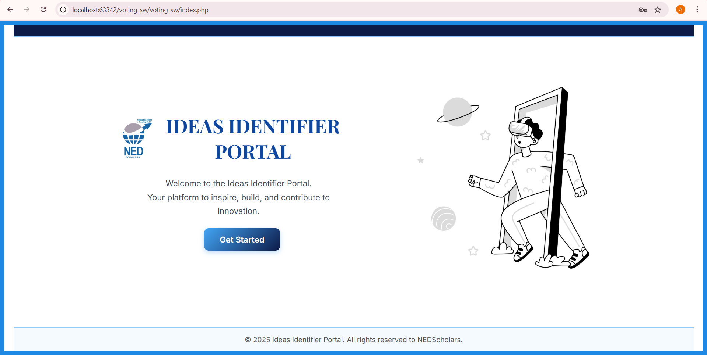
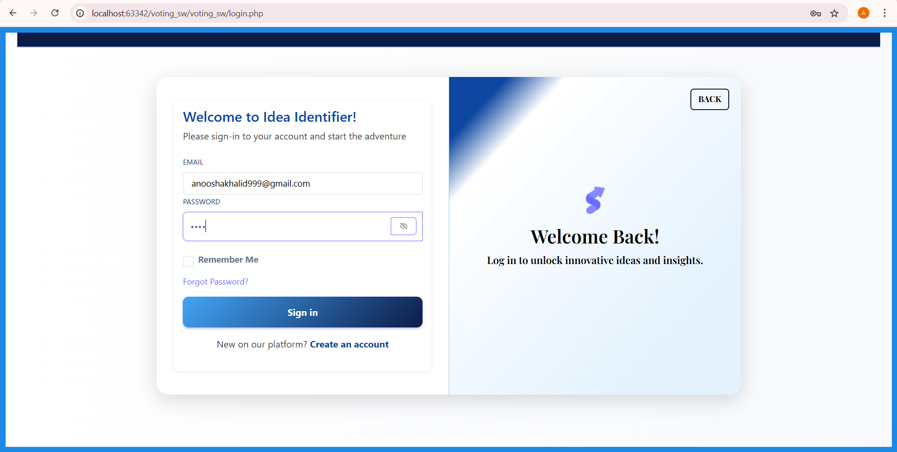
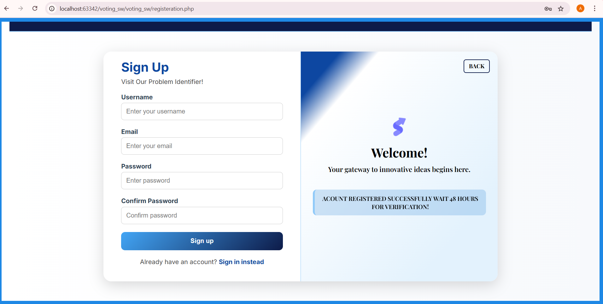

# Ideas Identifier User Interface - NED Scholars

This repository contains the **UI components only** for the Ideas Identifier Portal developed for NED Scholars. It is focused solely on frontend structure and styling using PHP and standard web technologies.

## Included Pages

- `index.php`: Landing page introducing the portal.
- `login.php`: Secure user login interface.
- `registration.php`: New user registration form.

These files are strictly related to the user interface and layout. No backend logic or sensitive implementation is included in this repository.

## Technologies Used

- HTML5 and CSS3
- PHP 
- Bootstrap 5
- Boxicons

## Key Features

- Responsive layout optimized for both desktop and mobile.
- Password visibility toggle for enhanced usability.
- Styled alert messages using PHP sessions.
- Clean, modern layout structure with a fixed footer.
- Back navigation links for improved user flow.

## UI Previews

Below are snapshots of the core UI pages included in this repository:

### 1. Landing Page (`index.php`)

### 2. Login Page (`login.php`)

### 3. Registration Page (`registration.php`)

## Confidentiality Notice

This repository contains only the public-facing UI pages. All backend logic, authentication processes, database connections, and additional internal files are part of a private system and are **not** included or meant to be shared.

## License

This project is provided for educational and UI reference purposes only. Redistribution of any private system components is strictly prohibited.
